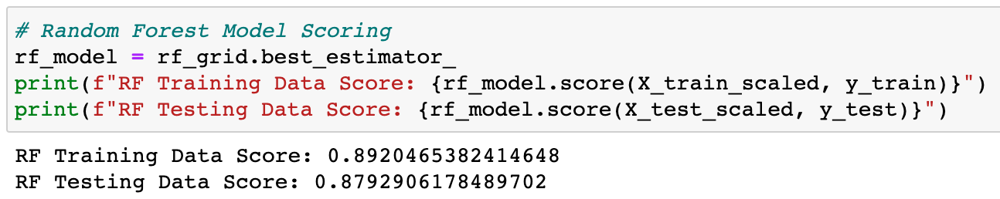
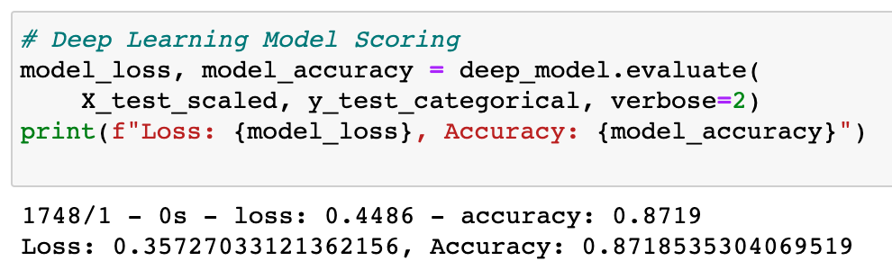
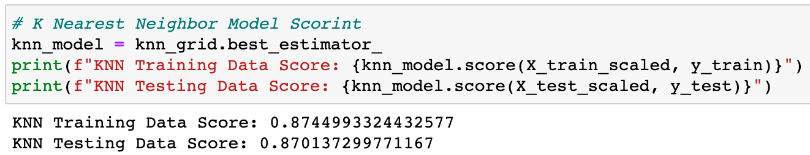
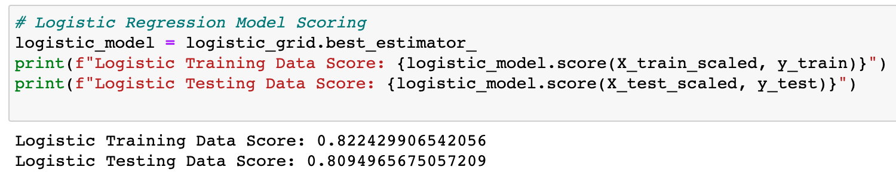
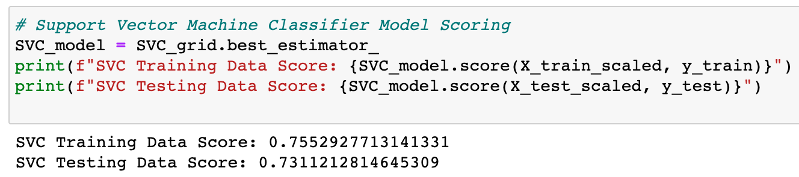

### Purpose of this analysis:
For the past 9 years, the NASA Kepler space telescope has been searching for hidden planets outside of our solar system. The purpose of this analysis is to create machine learning models capable of classifying candidate exoplanets from the raw dataset. This was done by preprocessing the raw data, tuning 5 different models using GridSearch, and then comparing the models to see which one was the most accurate. The most accurate model was saved at the end.

---

### Data collected:

---

### Results & Summary:
Based on the test data scores of each model (shown in the images above), the order of accuracy of the models is as follows:
1. Random Forests- 0.879
1. Deep Learning Neural Network- 0.872
1. K Nearest Neighbors- 0.870
1. Logistic Regression- 0.809
1. Support Vector Machine Classifier- 0.731
<!-- end list -->
The top 3 models- Random Forests, Deep Learning, and K Nearest Neighbors- were all very close to each other in accuracey, with only a difference of 0.009 between first and third place, whereas fourth, and especially fifth, place were significantly less accurate.

In order to predict new exoplanets, the Random Forest model should be used. However, even though it was the most accurate model out of the bunch, its accuracy is still less than 0.9. Therefore, there is still room for improvement in terms of its ability to predict new exoplanets. In order to improve accuracy, more hyperparameters and options within each hyperparameter could be added when tuning/fitting the model. For example, for the Random Forest model, there are 10+ hyperparameters that can be tuned (i.e. n_estimators, max_features, max_depth, min_samples_split, min_samples_leaf, bootstrap) and countless options to put inside of each hyperparameter for the GridSearch to check. However, I only used 3 hyperparameters (n_estimators, max_depth, min_samples_leaf) with 3-4 options within each. Another way the model's accuracy could be improved is if the "cv" in the GridSearchCV parameter was increased in order to increase the amount of folds per hyperparameter combination. The reason I didn't added more hyperparameters or a greater cv is because they would make the code more computationally expensive, increasing the amount of time it takes to run. This is the trade-off between having a more accurate model and saving time.

In addition to improving the accuracy of the Random Forest model, the accurary of the Deep Learning Model could be improved as well. Since its accuracy was only 0.007 less than the Random Forest's, it's possible that if more hidden layers were added to the model, the accuracy could have improved to over 0.9. Once again, the reason more hidden layers were not added is because it would make the code more computationally expensive.

---

### How to run the code:
1. Save the files "exoplanet_model_testing.ipynb" and "exoplanet_data.csv" to a file on your computer.
1. On your terminal, cd into the folder you saved the files in.
1. Run the command "jupyer notebook" to open up Jupyter Notebook.
1. Run all of the cells.
